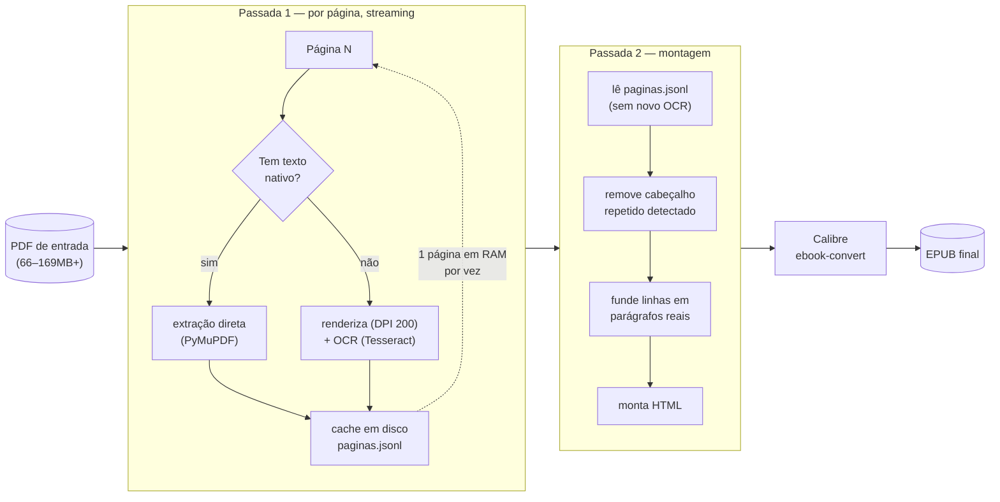

# Foliant

Pipeline offline e leve que transforma um PDF grande ou escaneado num
e-book pronto para Kindle (EPUB, com OCR em português), sem nunca carregar
o documento inteiro em memória.

## Avaliação Técnica

- **RAM praticamente constante independente do tamanho do livro**: pico
  de ~282MB (`peak memory footprint`) testado tanto em 80 páginas/66MB
  quanto em 208 páginas/169MB — diferença de 0,03% entre os dois,
  arquitetura de streaming + cache em disco (JSON-lines) validada com
  dado real, não estimativa. Ver
  [`ARCHITECTURE.md`](ARCHITECTURE.md#validação-de-carga-ram-não-escala-com-o-tamanho-do-livro).
- **Heurísticas calibradas contra dado real, com risco residual
  declarado explicitamente**, não escondido: cada limiar (detecção de
  cabeçalho repetido, título de capítulo, início de parágrafo) documenta
  em quantos livros/páginas foi calibrado, qual generalização não foi
  testada, e um cenário concreto que poderia quebrá-lo. Ver
  [`TRACE.md`](TRACE.md) para um episódio completo (hipótese → evidência
  que a refutou → correção) e a seção "risco residual" de cada fase em
  `ARCHITECTURE.md`.
- **Decisão Python vs. WebAssembly documentada com critérios
  explícitos**, não por preferência de stack — ver
  [`AUDITORIA_ARQUITETURA_2026.md`](AUDITORIA_ARQUITETURA_2026.md).
- **Bugs reais corrigidos durante validação, não só features
  implementadas**: `TASKS.md`/`ARCHITECTURE.md` registram erros de
  lógica e suposições erradas encontrados no próprio processo de
  validação (ex.: uma correção calibrada contra o caminho errado do
  pipeline, achada só ao rodar o código de produção contra o dado real
  antes de fechar a tarefa — ver [`TRACE.md`](TRACE.md)).
- **Metodologia de desenvolvimento**: decisões técnicas com trade-offs
  explícitos (ex.: reversão do `RENDER_DPI` de 300 para 200 depois de
  medir um defeito pior introduzido pelo DPI mais alto) registradas como
  parte do histórico do projeto, não só o resultado final — ver
  `TASKS.md`.

## O problema

Livros escaneados em PDF — digitalizações de biblioteca, apostilas,
material acadêmico — costumam vir sem camada de texto (só imagem) e podem
ter centenas de páginas e centenas de megabytes. Ler isso num Kindle exige
um e-book pesquisável, mas as ferramentas comuns de conversão carregam o
PDF inteiro na RAM, o que trava máquinas modestas em arquivos grandes, e a
Amazon descontinuou o KindleGen (o gerador oficial de MOBI), deixando
EPUB como o formato de fato para quem monta o próprio pipeline hoje.

O Foliant existe para preencher essa lacuna: processa o PDF **página por
página** (OCR, extração de texto, limpeza), com uso de RAM praticamente
constante independente do tamanho do arquivo, e converte o resultado para
EPUB via Calibre. Sem serviço na nuvem, sem upload do livro para
terceiros, sem depender de ferramentas que resolvem só um pedaço do
pipeline (OCR *ou* conversão, não as duas com controle de memória).



RAM medida (`peak memory footprint`) fica praticamente igual entre os
dois testes de carga (80 e 208 páginas) porque nunca mais que uma
página de texto/imagem fica em memória de uma vez — o cache em disco
(`paginas.jsonl`) é o que permite à Passada 2 remover cabeçalhos
repetidos sem precisar reprocessar OCR nem manter o livro inteiro em
RAM. Detalhes e evidência completa em
[`ARCHITECTURE.md`](ARCHITECTURE.md).

## Instalação — app desktop (macOS)

O jeito mais simples de usar o Foliant é o app desktop empacotado
(`Foliant.app`/`Foliant_0.2.0_x64.dmg`, gerado via Tauri). Ele ainda
depende de Tesseract e Calibre instalados separadamente (ver seção
abaixo) — só o núcleo Python vem embutido.

1. Instale Tesseract e Calibre conforme a seção "Requisitos e instalação"
   abaixo.
2. Abra o `.dmg` e arraste `Foliant.app` para `/Applications`.
3. **Aviso do Gatekeeper**: como o app não é assinado com um certificado
   de desenvolvedor Apple (decisão consciente — o custo de US$99/ano do
   Apple Developer Program não se justifica para este projeto), o macOS
   vai bloquear a primeira abertura com "desenvolvedor não identificado".
   Para abrir mesmo assim: clique com o botão direito no ícone do app →
   **Abrir** → confirme no diálogo (ou: Preferências do Sistema →
   Privacidade e Segurança → "Abrir Assim Mesmo", logo após a primeira
   tentativa de abertura). Só é preciso fazer isso uma vez — atualizações
   futuras aplicadas pelo próprio app (ver abaixo) não repetem esse aviso,
   confirmado com teste real (ver Fase 4.9 em `ARCHITECTURE.md`).
4. Use o formulário para selecionar o PDF de entrada, o destino do EPUB,
   título, autor e idioma, e acompanhe o log de execução na própria
   janela.

**Atualizações automáticas** (a partir da v0.2.0): o app checa por uma
versão nova ao abrir e, se encontrar, baixa e instala sozinho (sem
diálogo de confirmação, mas sempre visível no log da janela), reiniciando
em seguida. Existe também um botão "Verificar atualizações" para checar
sob demanda. Isso só funciona a partir desta versão em diante — quem
tiver uma versão anterior à v0.2.0 instalada precisa repetir a instalação
manual (passos 1–3 acima) uma última vez para ganhar o mecanismo
automático. Nota: o canal de distribuição (GitHub Releases) ainda não
tem nenhuma versão publicada nesta máquina de desenvolvimento — só
funciona de fato quando o mantenedor publicar o primeiro Release com os
artefatos (ver `ARCHITECTURE.md`, Fase 4.9).

Para compilar o app a partir do código-fonte:

```bash
./scripts/build-sidecar.sh   # empacota foliant.py com PyInstaller
cd desktop && pnpm install && pnpm tauri build
```

(requer Rust/Cargo — instale via [rustup.rs](https://rustup.rs/) — e
Node/pnpm, além do venv Python com as dependências de
`requirements.txt` já instaladas)

Linux ainda não tem pacote pronto — use a instalação via Python direto
abaixo.

## Requisitos e instalação (rodando `foliant.py` direto via Python)

Tesseract via micromamba, Calibre via download direto.

**1. Tesseract (OCR), via [micromamba](https://mamba.readthedocs.io/en/latest/installation/micromamba-installation.html):**

```bash
micromamba create -n foliant-ocr -c conda-forge tesseract tesseract-lang
sudo ln -s ~/micromamba/envs/foliant-ocr/bin/tesseract /usr/local/bin/tesseract
export TESSDATA_PREFIX=~/micromamba/envs/foliant-ocr/share/tessdata
```

(adicione a linha do `export` ao seu `.zshrc`/`.bashrc` para persistir entre sessões)

**2. Calibre**, baixado direto do `.dmg` em [calibre-ebook.com](https://calibre-ebook.com/download) (não via `brew`). O binário usado é:

```
/Applications/calibre.app/Contents/MacOS/ebook-convert
```

Crie um symlink em `/usr/local/bin/ebook-convert` para o Foliant encontrá-lo no `PATH`.

**3. Dependências Python**, num `venv`:

```bash
python3 -m venv .venv
source .venv/bin/activate
pip install -r requirements.txt
```

## Uso

```bash
python3 foliant.py entrada.pdf saida.epub --autor "Nome do Autor"
```

## Estado atual do projeto

- **Fases 1–3: concluídas e validadas** contra dados reais — RAM
  praticamente constante (~282MB) independente do tamanho do PDF de
  entrada, testado até 169MB / 208 páginas.
- **Fase 4: concluída e validada** — empacotamento como app desktop via
  Tauri (sidecar PyInstaller), saída confirmada byte-idêntica ao pipeline
  Python original nos 2 livros de teste. Tesseract/Calibre continuam
  instalados separadamente (não embutidos nesta fase).
- **Fase 4.5: concluída parcialmente** — capa real extraída da 1ª página
  do PDF quando disponível (sem mais "capa genérica" do Calibre),
  validada nos 2 livros de teste. Supressão de ruído decorativo de OCR
  (ex.: logo de editora lido como texto) e extração de figuras internas
  reais (ex.: fluxogramas) foram investigadas com dados reais e
  conscientemente não implementadas — ver `ARCHITECTURE.md` para a
  colisão de dados encontrada.
- **Fase 5 (planejada)**: MVP web client-side.

Detalhes de arquitetura, decisões e o teste de carga que validou o
comportamento de memória estão em [`ARCHITECTURE.md`](ARCHITECTURE.md) e
[`TASKS.md`](TASKS.md). A avaliação que levou à decisão de manter o
núcleo em Python (em vez de reescrever para WebAssembly/edge) está em
[`AUDITORIA_ARQUITETURA_2026.md`](AUDITORIA_ARQUITETURA_2026.md).

## Metodologia de desenvolvimento

Este projeto foi desenvolvido com um padrão de trabalho em três papéis,
visível no histórico registrado em `TASKS.md`/`ARCHITECTURE.md`:

- **Estrategista**: antes de calibrar uma heurística ou implementar uma
  correção, o escopo é estruturado como um meta-prompt — objetivo,
  restrição a não regredir, e o dado real necessário antes de decidir
  qualquer limiar. Ver a skill [`implementation-planner`](.claude/skills/implementation-planner/SKILL.md)
  para a estrutura exata, extraída do próprio histórico do projeto.
- **Executor**: implementa contra dado real (nunca contra exemplo
  inventado), valida rodando o pipeline de produção de verdade — não
  uma função isolada — e registra risco residual explicitamente em vez
  de declarar generalização não testada. Ver a skill
  [`skeptical-review`](.claude/skills/skeptical-review/SKILL.md).
- **Checkpoint humano**: o usuário testa manualmente o resultado final
  antes de uma fase ser considerada fechada, sobretudo quando o próprio
  agente não consegue confirmar o resultado no ambiente em que roda —
  por exemplo, as Fases 4.1–4.3 (app desktop) foram encerradas só depois
  de teste manual do usuário revelar, em sequência, três bugs distintos
  que a validação automatizada do agente não podia expor (a automação de
  acessibilidade contra um binário macOS sem assinatura de código era
  bloqueada pelo TCC do sistema — limitação do ambiente de teste, não do
  app). Isso é registrado em `TASKS.md` como limitação de ambiente, não
  escondido como se a validação tivesse sido completa.

**Quando esse padrão não foi usado, por completo**: nem toda fase
dependeu de checkpoint humano para fechar. A Fase 4.4 (correção de
recuo de linha) foi fechada com validação inteiramente automatizada —
o próprio agente rodou o pipeline de produção contra os PDFs reais e
comparou o HTML gerado byte a byte, sem esperar teste manual, porque o
critério de aceite (parágrafos fundidos corretamente, subtítulos
preservados) era verificável programaticamente. O checkpoint humano é
usado quando o critério de aceite genuinamente exige um julgamento ou
uma interação que o agente não consegue reproduzir no seu ambiente
(clicar um botão numa UI desktop, avaliar se um texto "lê bem") — não
como um passo ritual em toda fase, independente de precisar dele ou
não. Tratar o checkpoint humano como opcional quando a validação
automatizada já é suficiente é, na prática, parte do mesmo padrão de
disciplina descrito nas skills acima: não pedir mais evidência do que o
critério de aceite exige, mas também não menos.

## Limitações conhecidas

As heurísticas de detecção (cabeçalho de página repetido, título de
capítulo) foram calibradas contra apenas **2 livros reais**. Isso é
suficiente para validar o mecanismo, não para provar que generaliza —
risco residual documentado explicitamente em `ARCHITECTURE.md`. Livros
com layout muito diferente dos dois testados podem exigir ajuste dos
limiares antes de produzir um resultado limpo.

Elementos gráficos decorativos (logos de editora, ornamentos) em
páginas escaneadas são OCRizados como texto, viram ruído visível no
EPUB (ex.: um logo lido como `"x*"`) e não são suprimidos — investigado
e não resolvido, ver Fase 4.5 em `ARCHITECTURE.md`. Figuras internas
reais mencionadas no texto (fluxogramas, nomogramas) também não são
extraídas como imagem — o EPUB gerado a partir de um livro escaneado
não tem nenhuma imagem de conteúdo, só a capa (quando extraível).

**Cancelar/fechar o app pode acumular lixo em disco, sem aviso.** Ao
cancelar uma conversão (botão "Cancelar" ou fechar a janela), o app mata
o sidecar e o Tesseract de forma confiável — sem processo pendurado em
background (validado com dado real, ver Fase 4.7 em `ARCHITECTURE.md`).
Só que, numa janela de tempo pequena (se o processo Python não reagir ao
sinal de cancelamento a tempo), o binário do sidecar pode deixar pra trás
uma pasta temporária `_MEIxxxxxx` de dezenas de MB (o binário inteiro
descompactado). Isso **não é peculiaridade deste app** — é uma limitação
conhecida e não resolvida do PyInstaller `--onefile` há vários anos
(ver [issue #902](https://github.com/pyinstaller/pyinstaller/issues/902),
[#2379](https://github.com/pyinstaller/pyinstaller/issues/2379),
[#5518](https://github.com/pyinstaller/pyinstaller/issues/5518)): a
limpeza dessa pasta só acontece se o processo termina normalmente, nunca
se é morto à força.

**E essas pastas não são limpas sozinhas depois.** Confirmado nesta
máquina: a limpeza automática diária do macOS (`periodic`) só cobre
`/tmp`, não a pasta de temporários por usuário onde isso realmente cai
(a mesma pasta que `tempfile.gettempdir()` retorna no Python — não é
`/tmp`, ver detalhe em `ARCHITECTURE.md`) — pastas de mais de um mês
atrás seguem lá, intocadas. Ou seja, cancelamentos
mal-sucedidos repetidos **acumulam indefinidamente**, sem qualquer aviso
do sistema — o tipo de coisa que só aparece meses depois como "o disco
está enchendo sozinho", sem relação óbvia com o Foliant. Se isso
acontecer, procure manualmente por pastas `_MEIxxxxxx` (e por `tess_*` e
`tmp*` órfãos do mesmo tipo) dentro da saída de `getconf DARWIN_USER_TEMP_DIR`
no Terminal, e apague as que não pertencerem a nenhum processo em
execução.

## Licença

O Foliant depende do [PyMuPDF](https://pymupdf.io/), distribuído sob
licença dual **AGPL v3 / comercial** (Artifex). Segundo a própria posição
dos mantenedores do PyMuPDF, qualquer aplicação que o utiliza deve ser
licenciada como AGPL-3.0 (software livre e de código aberto) ou obter uma
licença comercial da Artifex — não há um meio-termo permissivo (MIT,
Apache 2.0) sem esse acordo comercial (ver
[discussão oficial](https://github.com/pymupdf/PyMuPDF/discussions/971)).

Como o Foliant é software livre, ele é distribuído sob a
**[GNU Affero General Public License v3.0](LICENSE)**, que satisfaz essa
condição.

## Contribuições

Contribuições, issues e sugestões são bem-vindas. Abra uma issue para
discutir bugs ou propostas antes de enviar um PR.
